# Uitleg-beeldbank

Zelfgetekende uitlegplaatjes en eenvoudige teksten (taalniveau B1) voor tijdens het consult in de huisartsenpraktijk.
Laat een patiënt zien wat er in de longen, het hart, de bloedvaten, de hersenen, de urinewegen of de gewrichten gebeurt, stap voor stap, op een tablet of een groot scherm.

Iedereen mag de plaatjes en teksten gebruiken, aanpassen en aanvullen, ook in de eigen praktijk of op de eigen website.
Wel graag met naamsvermelding en onder dezelfde licentie (zie [Licentie](#licentie)).

De onderwerpen komen van [uitleg.tolgaarde.nl](https://uitleg.tolgaarde.nl), de uitlegpagina's van Huisartsenpraktijk Tolgaarde in Leusden.

## Onderwerpen

| Onderwerp | Plaatje | Wat zit erin |
|---|---|---|
| [SSRI](ssri/) |  | hoe een SSRI werkt (4 stappen), wanneer het werkt, hoe lang en afbouwen, let op |
| [Astma](astma/) |  | luchtweg in 5 stappen, twee soorten medicijnen, prikkels (9 pictogrammen), zelf doen en bellen |
| [COPD](copd/) |  | gezond en COPD, stoppen met roken (longfunctie per leeftijd), zelf doen, longaanval |
| [Hartfalen](hartfalen/) |  | hart als pomp, dagelijks wegen, medicijnen, zelf doen en bellen |
| [Boezemfibrilleren](boezemfibrilleren/) |  | ritme in 4 stappen (met hartfilmpje), behandeling, zelf doen en bellen |
| [Prostaat](prostaat/) |  | prostaat in 4 stappen (gewoon, groter, kanker, blaas en bekkenbodem), het verschil, zelf doen en medicijnen, PSA-test, bellen |
| [Blaasontsteking](blaasontsteking/) |  | infectie in 4 stappen (blaas, nier, prostaat), plas testen, welk antibioticum waar werkt (zonder doseringen), zelf doen, bellen |
| [Hoge bloeddruk](hoge-bloeddruk/) |  | bloeddruk in 4 stappen (gewoon, hoog, na jaren, wat helpt), totale risico, zelf thuis meten, zelf doen en medicijnen, bellen |
| [Diabetes type 2](diabetes-type-2/) |  | suiker en insuline in 4 stappen, zelf doen, medicijnen (zonder doseringen) en een te lage suiker, controles en voeten (7 pictogrammen), bellen |
| [Knieartrose](knieartrose/) |  | knie in 4 stappen (gezond, artrose, sterke spieren, minder gewicht), wat je merkt, zelf doen, pijnstillers en een prik, bellen |
| [Lage rugpijn](lage-rugpijn/) |  | rug in 4 stappen (gezond, gewone rugpijn, hernia, bewegen helpt), hoe lang het duurt, zelf doen en pijnstillers, foto of scan, bellen |
| [Schildklier (te traag)](schildklier/) |  | schildklier in 3 stappen, het tablet innemen, bloed prikken en controle, zwanger worden of zijn, bellen |
| [Meniscusklachten](meniscus/) |  | knie in 4 stappen (gezond, scheur na een draai, knie op slot, slijtage), na een draai of door slijtage, tijdlijn herstel, zelf doen en pijnstillers, bellen |

## Zo is een onderwerp opgebouwd

```
astma/
├── beelden/        losse tekeningen (SVG); bij een stap-voor-stap-uitleg één bestand per stap
├── pictogrammen/   kleine pictogrammen (alleen als het onderwerp ze heeft)
├── tekst.md        de tekst in B1, met de plaatjes op hun plek
├── bronnen.md      Thuisarts-pagina's en de NHG-Standaard waar de tekst op rust
└── pagina.html     voorbeeldpagina, werkt los (dubbelklikken) en zonder internet
```

`gedeeld/` bevat de stijl (`stijl.css`) en het kleine script voor de stapknoppen (`uitleg.js`) van de voorbeeldpagina's.

## Gebruiken

- **Een plaatje**: download de SVG uit `beelden/`. Het opent in elke browser en schaalt zonder kwaliteitsverlies.
  Je kunt het in een eigen pagina zetten (``), in een presentatie of in een folder.
  Sommige plaatjes bewegen een beetje (een kloppend hart, stromend bloed); wie dat uit heeft staan
  (“beweging beperken”), ziet een stilstaand plaatje.
- **De tekst**: neem `tekst.md` over en pas hem aan je praktijk aan. Houd de bronnen in `bronnen.md` erbij.
- **Een hele pagina**: open `pagina.html` om te zien hoe het samen werkt, met knoppen om door de stappen te lopen.
- **Aanpassen**: de tekeningen zijn gewone SVG (tekst in een editor, of in Inkscape of Figma). Kleuren en teksten
  staan leesbaar in het bestand.

## Bijdragen

Een nieuw onderwerp, een betere tekening of een correctie is welkom. Lees eerst [CONTRIBUTING.md](CONTRIBUTING.md):
elk onderwerp heeft een bron (Thuisarts of NHG), is in B1 geschreven en bevat geen doseringen, merknamen of
patiëntgegevens. Bijdragen gaan via een pull request.

## Licentie

- **Teksten en tekeningen**: [Creative Commons Naamsvermelding-GelijkDelen 4.0 Internationaal (CC BY-SA 4.0)](https://creativecommons.org/licenses/by-sa/4.0/deed.nl), zie [LICENSE](LICENSE).
  Naamsvermelding: **Huisartsenpraktijk Tolgaarde / Socev** (en bij aanvullingen ook de makers daarvan).
  Pas je iets aan en deel je het, dan onder dezelfde licentie.
- **Code** (`gedeeld/stijl.css`, `gedeeld/uitleg.js` en eventuele scripts): MIT, zie [LICENSE-MIT](LICENSE-MIT).

## Let op

Deze uitleg is algemeen en vervangt geen gesprek met een arts. De inhoud is zorgvuldig getoetst aan Thuisarts,
maar standaarden veranderen: controleer de bron voordat je een onderwerp gebruikt. Er staan geen doseringen in en
geen gegevens van patiënten of praktijken.
