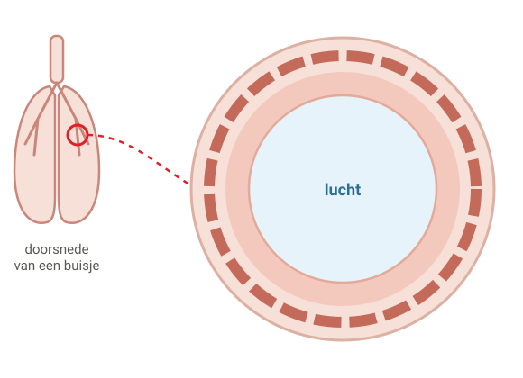
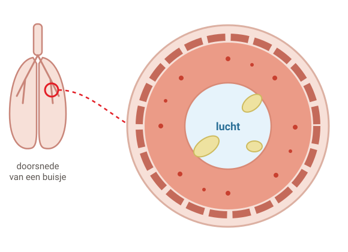
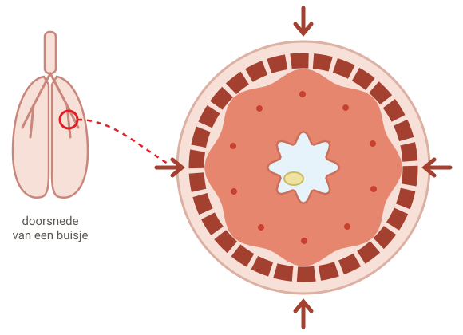
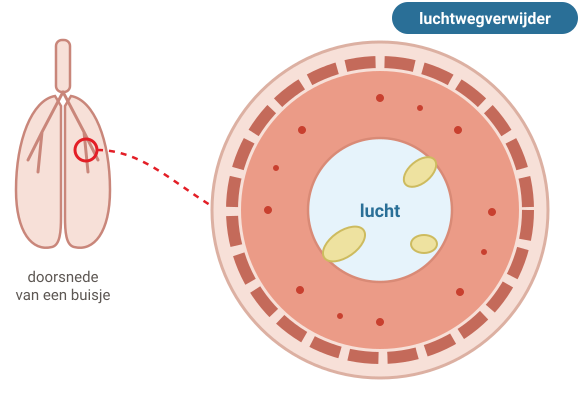
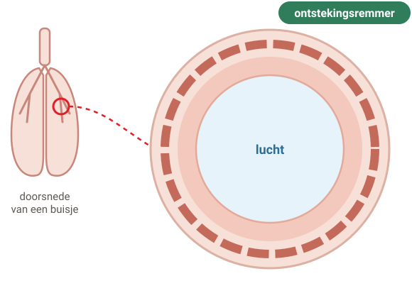
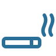
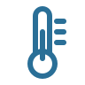
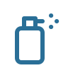

# Astma

Bij astma zijn de buisjes in je longen extra gevoelig. Ze raken ontstoken en worden nauwer. Dan krijg je moeilijk lucht.

## 1. Wat gebeurt er in je longen?

Legenda: lucht, slijmvlies (binnenkant), spiertjes, slijm.

### Stap 1: Gezond

#### Een gezond buisje

Lucht gaat via buisjes je longen in en uit. Een gezond buisje is **ruim**. De lucht kan er makkelijk door.

### Stap 2: Astma

#### Astma: het buisje is ontstoken

Bij astma reageren de buisjes op prikkels, zoals stof of rook. De binnenkant raakt **ontstoken en dik**. Er komt **meer slijm**.

Je hoest en je bent sneller benauwd.

### Stap 3: Aanval

#### Een aanval: de spiertjes knijpen

De spiertjes rond het buisje **knijpen samen**. Het buisje wordt nog nauwer.

Je bent erg benauwd. Je hoort vaak een piepend geluid bij het uitademen.

### Stap 4: Luchtwegverwijder

#### Luchtwegverwijder: snel

Dit medicijn **ontspant de spiertjes**. Het buisje gaat weer open. Na ongeveer **10 minuten** adem je beter.

Let op: de ontsteking en het slijm zijn er nog.

### Stap 5: Ontstekingsremmer

#### Ontstekingsremmer: langzaam

Dit medicijn maakt de **ontsteking minder**. Het buisje wordt weer ruimer en er komt minder slijm.

Het werkt na **een paar weken**. Je gebruikt het meestal elke dag, ook als je je goed voelt.

## 2. Twee soorten medicijnen

#### Luchtwegverwijder

Snel: na ongeveer 10 minuten

Maakt de buisjes wijder. Je kunt er trillende handen of een snelle hartslag van krijgen.

#### Ontstekingsremmer

Langzaam: na een paar weken

Maakt de ontsteking minder en beschermt de buisjes. Spoel na het puffen je mond met water.

#### Goed puffen is belangrijk

Je ademt de medicijnen in met een puffer. Soms zitten beide medicijnen in één puffer. Die gebruik je soms alleen bij klachten; je arts spreekt dat met je af. Laat je puftechniek af en toe nakijken.

## 3. Wat maakt astma erger?

-  huisstofmijt
-  huisdieren
-  pollen
-  rook (ook meeroken)
-  verkoudheid, griep
-  kou en mist
-  inspanning
-  stress
-  sterke geuren

Ook fijnstof (houtkachel, vuurwerk) en sommige pijnstillers kunnen astma erger maken.

## 4. Wat kun je zelf doen?

- **Rook niet** en blijf uit de rook van anderen.
- **Beweeg elke dag**, bijvoorbeeld een half uur wandelen of fietsen.
- Te zwaar? Probeer **af te vallen**.
- Gebruik je medicijnen **zoals afgesproken**.
- Maak samen een **actieplan**: wat doe je als het slechter gaat?
- Elke dag medicijnen? Haal de **griepprik**.

#### Afspraak maken

- Je hebt vaker dan 2 keer per week de luchtwegverwijder nodig.
- Je wordt 's nachts wakker door je astma.
- Je krijgt steeds meer last.
- Puffen lukt niet goed.

#### **Spoed** — Bel meteen

Je wordt steeds benauwder en je medicijnen helpen niet. Je kunt moeilijk een zin zeggen. Je ademt heel snel. Bel je huisarts of de huisartsenpost.

**Bel 112** als iemand bijna niet meer kan ademen, niet goed reageert of blauwe lippen krijgt.

---

Deze uitleg is algemeen. Wat voor jou geldt, bespreek je met je huisarts.

Tekst en tekeningen: Huisartsenpraktijk Tolgaarde / Socev, [CC BY-SA 4.0](https://creativecommons.org/licenses/by-sa/4.0/deed.nl).
