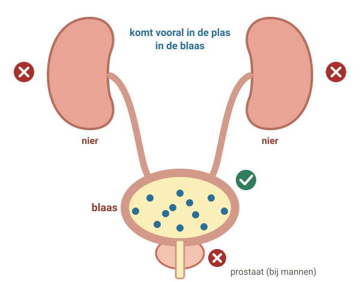
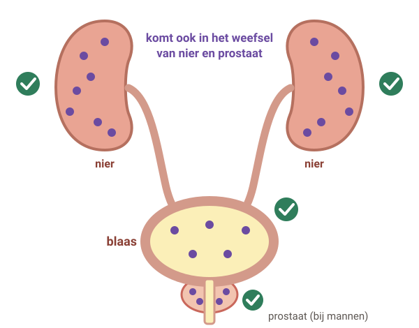

# Blaasontsteking en urineweginfectie

Een blaasontsteking komt veel voor en is meestal niet ernstig. Soms gaat de infectie dieper: naar de nier of de prostaat. Dan word je zieker en heb je een ander antibioticum nodig.

## 1. Wat gebeurt er bij een infectie?

Legenda: bacterie, plas, ontsteking in het weefsel.

### Stap 1: Gezond

#### Gezonde urinewegen

Je **nieren** maken plas. Die gaat via het **nierbekken** en de **urineleiders** naar de **blaas**.

Via de **plasbuis** plas je het uit.

### Stap 2: Blaasontsteking

#### Blaasontsteking

Bacteriën komen via de plasbuis in de blaas. Vaak zijn het bacteriën uit de darm. Alleen de **binnenkant van de blaas** raakt ontstoken.

Plassen doet pijn of brandt. Je moet vaak, maar er komt maar een klein beetje. Soms zit er bloed in je plas.

Je hebt **geen koorts**.

### Stap 3: Nierbekken-ontsteking

#### Nierbekken-ontsteking

De bacteriën gaan omhoog naar de nier. Nu gaat de infectie **het weefsel in**: de nier zelf.

Je wordt opeens ziek: **koorts**, koude rillingen en **pijn in je rug of zij**.

In het begin is er soms geen koorts. Ouderen krijgen niet altijd koorts. Je hebt altijd antibiotica nodig. Bel dezelfde dag.

### Stap 4: Prostaat-ontsteking

#### Prostaat-ontsteking

Bij mannen kan de infectie ook **de prostaat** ingaan. Ook dat is een infectie in het weefsel.

Je wordt opeens ziek: **koorts**, en **pijn tussen je anus en je balzak**.

In het begin is er soms geen koorts. Ouderen krijgen niet altijd koorts. Je hebt altijd antibiotica nodig. Bel dezelfde dag.

## 2. Hoe testen we je plas?

#### 1. Teststrookje

Meestal binnen 1 dag

Op de praktijk gaat een strookje in je plas. Dat kijkt naar een stof die bacteriën maken (nitriet) en naar witte bloedcellen.

#### 2. Soms extra onderzoek

Als het strookje niet duidelijk is

Dan doen we soms een extra test op de praktijk.

#### 3. Kweek in het lab

Uitslag na ongeveer 1 week

Het lab zoekt uit **welke bacterie** het is en **welk antibioticum** werkt. Dat doen we bijvoorbeeld bij mannen, als je zwanger bent, bij koorts, en als de antibiotica niet goed helpen.

### Je plas inleveren

- Plas in een schoon potje met deksel. Het liefst als je 4 uur niet hebt geplast, bijvoorbeeld 's ochtends.
- Breng het binnen 2 uur. Lukt dat niet? Zet het in de koelkast en breng het binnen 24 uur.

#### Geen klachten? Dan geen test

Ruikt je plas alleen anders of is hij troebel? Dan heeft testen geen zin. Er zitten vaak bacteriën in de plas zonder dat je ziek bent, vooral bij ouderen. Onnodig antibiotica slikken is niet goed: bacteriën kunnen er ongevoelig voor worden.

## 3. Welk antibioticum? Het hangt af van waar de infectie zit

### Stap 1: Middel voor de blaas

#### Nitrofurantoïne en fosfomycine

Deze middelen komen vooral **in je plas in de blaas**. Daar werken ze goed tegen een gewone blaasontsteking.

In het weefsel van de **nier** of de **prostaat** komt **te weinig**. Bij een nierbekken- of prostaat-ontsteking helpen ze dus niet goed.

### Stap 2: Middel voor het weefsel

#### Bij een infectie in het weefsel

Dan krijg je een middel dat **ook in het weefsel** komt. Bijvoorbeeld **ciprofloxacine**, **amoxicilline met clavulaanzuur** of **cotrimoxazol**.

Je krijgt eerst een middel dat tegen de meeste bacteriën helpt. Na de kweek krijg je soms een ander middel.

#### Afwachten mag soms

Ben je een gezonde vrouw en niet zwanger? Dan gaat de helft van de blaasontstekingen binnen 1 week vanzelf over. Je kiest samen: afwachten, antibiotica, of een recept voor als het niet overgaat.

#### Altijd antibiotica

Bij mannen, bij zwangeren, bij diabetes of een minder goede afweer, bij een ziekte van de nieren of blaas, en bij elke infectie in het weefsel.

#### Maak de kuur af

Slik de antibiotica op vaste tijden en tot ze op zijn, ook als je je al beter voelt. Anders kan de infectie terugkomen.

Ben je zwanger of gaat het om een kind? Dan kiest de huisarts soms een ander middel.

## 4. Wat kun je zelf doen?

- **Drink veel**, tot 3 liter per dag: water, thee of melk. Heb je hartfalen? Vraag je arts hoeveel je mag drinken.
- Last van pijn? Een paar dagen **paracetamol** kan helpen.
- Ga **meteen plassen** als je moet.

- Plas je blaas **helemaal leeg**: zit rechtop, voeten plat op de grond, neem de tijd en pers niet.
- Ga **na seks plassen**.
- Gebruik geen glijmiddel dat zaadcellen doodt.

## 5. Wanneer bellen?

#### **Spoed** — Bel meteen

Je huisarts of de huisartsenpost, als je erg ziek bent en:

- je ademt snel of je hart klopt snel
- je bent in de war of reageert niet goed (dan belt iemand anders)

#### **Vandaag** — Bel dezelfde dag

Je huisarts of de huisartsenpost, bij:

- koorts (38 graden of hoger) of koude rillingen
- pijn in je zij of rug, of pijn tussen anus en balzak
- je voelt je ziek

#### **Vandaag** — Klachten van een blaasontsteking en …

- je bent zwanger
- je bent een man
- het gaat om een kind jonger dan 12 jaar
- je had al eens een nierbekken-ontsteking
- je afweer is minder goed, bijvoorbeeld door diabetes of medicijnen
- je hebt een ziekte van je nieren of blaas

Bel dan **dezelfde dag**.

#### Met antibiotica en nog klachten

- Nierbekken- of prostaat-ontsteking: na 2 dagen niet beter of nog koorts, je wordt zieker of weer ziek, of je spuugt de pillen uit. Bel **dezelfde dag**.
- Blaasontsteking: 2 dagen na de laatste pil nog klachten. Bel op een werkdag en neem een potje verse plas mee.

#### Bel op een werkdag

- Je hebt veel last en wilt niet afwachten.
- Je hebt afgewacht en na 1 week is het niet minder.
- Je hebt 3 keer per jaar of vaker een blaasontsteking.
- Je denkt dat het misschien een soa is.

---

Deze uitleg is algemeen. Wat voor jou geldt, bespreek je met je huisarts.

Tekst en tekeningen: Huisartsenpraktijk Tolgaarde / Socev, [CC BY-SA 4.0](https://creativecommons.org/licenses/by-sa/4.0/deed.nl).
