# Boezemfibrilleren

Bij boezemfibrilleren klopt je hart onregelmatig, en vaak snel. Een andere naam is atriumfibrilleren. Het is niet direct gevaarlijk, maar de kans op een beroerte is groter.

## 1. Wat gebeurt er in je hart?

### Stap 1: Normaal ritme

#### Normaal ritme

De **sinusknoop** is de gangmaker van je hart. Hij geeft steeds een seintje: een klein stroomstootje.

Eerst knijpen de **boezems**, dan de **kamers**. Je hart klopt regelmatig.

### Stap 2: Boezemfibrilleren

#### Boezemfibrilleren

In de boezems lopen **veel seintjes door elkaar**. De boezems trillen in plaats van goed te knijpen.

De AV-knoop laat de seintjes onregelmatig door. Je hart klopt **onregelmatig**, en vaak snel.

Je kunt hartkloppingen voelen, moe of duizelig zijn. Sommige mensen merken er niets van.

### Stap 3: Stolsel

#### Kans op een stolsel

Omdat de boezems trillen, stroomt het bloed langzamer. Vooral in het **hartoor** (een klein zakje aan de boezem) kan dan een **stolsel** ontstaan.

Een stolsel kan naar de hersenen gaan. Dat geeft een **beroerte** (herseninfarct).

### Stap 4: Bloedverdunner

#### Een bloedverdunner beschermt

Een bloedverdunner maakt de kans op een stolsel en een beroerte **kleiner**. Je hart kan wel onregelmatig blijven.

Niet iedereen heeft een bloedverdunner nodig. Dat hangt af van je leeftijd en andere ziektes. Je huisarts rekent je risico uit en bespreekt het met je.

## 2. De behandeling

#### 1. Beroerte voorkomen

Met een bloedverdunner, als jouw risico groot genoeg is.

#### 2. Hartslag rustiger

Als je last hebt van de snelle hartslag

Een medicijn laat je hart langzamer kloppen. Het ritme mag onregelmatig blijven. Je voelt je rustiger en bent minder snel moe.

#### 3. Ritme weer normaal

Soms

Soms probeert de hartspecialist (cardioloog) het ritme weer regelmatig te krijgen. Met medicijnen, een stroomstoot, of een behandeling via een bloedvat.

## 3. Wat kun je zelf doen?

Gezond leven maakt de klachten minder. En het helpt je hart en bloedvaten.

#### Bewegen

Minstens 2,5 uur per week, bijvoorbeeld wandelen of fietsen.

#### Geen alcohol

Alcohol kan een aanval uitlokken en maakt het erger.

#### Niet roken

Vraag hulp bij stoppen. Dan lukt het vaker.

#### Gewicht en bloeddruk

Val af als je te zwaar bent. Laat een hoge bloeddruk behandelen.

#### Snurken

Snurk je hard en ben je overdag erg moe? Zeg het je huisarts. Adempauzes in je slaap kunnen boezemfibrilleren erger maken.

#### Met een bloedverdunner

Geen ibuprofen, naproxen of diclofenac. Vertel je tandarts en apotheek dat je een bloedverdunner gebruikt.

## 4. Wanneer bellen?

#### **112** — Tekenen van een beroerte

Opeens een scheve mond, een arm of been dat verlamd voelt, moeilijk praten, minder of dubbel zien, of in de war. **Bel meteen 112.**

#### **Spoed** — Bel meteen je huisarts

Of de huisartsenpost: opeens pijn op de borst, (bijna) flauwvallen, erg benauwd, of een heel snelle hartslag die niet zakt.

#### **Spoed** — Met een bloedverdunner

Bel direct bij: bloed ophoesten of overgeven, zwarte ontlasting, bloed in je plas, een harde val op je hoofd, of een bloeding die niet stopt.

#### Afspraak maken

- Je houdt veel klachten, ook met medicijnen.
- Je klachten waren weg en komen terug.
- Je hebt last van bijwerkingen of vragen over je medicijnen.

---

Deze uitleg is algemeen. Wat voor jou geldt, bespreek je met je huisarts.

Tekst en tekeningen: Huisartsenpraktijk Tolgaarde / Socev, [CC BY-SA 4.0](https://creativecommons.org/licenses/by-sa/4.0/deed.nl).
