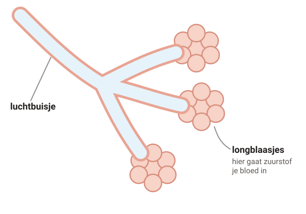
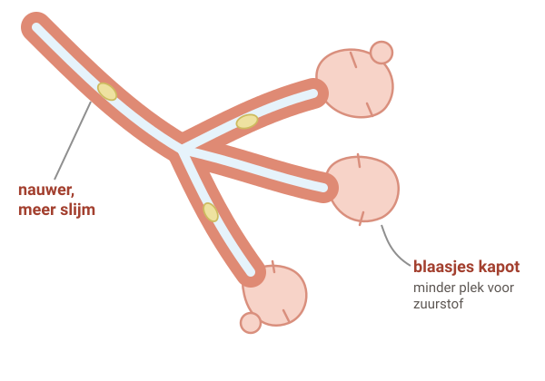
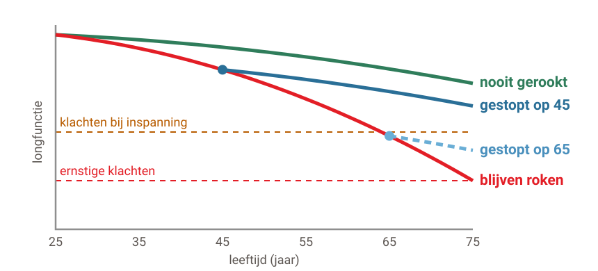

# COPD

COPD is een longziekte die niet meer overgaat. Het komt bijna altijd door roken. Je kunt wel veel doen om fit te blijven.

## 1. Wat gebeurt er in je longen?

### Stap 1: Gezond

#### Gezonde longen

Lucht gaat door de **buisjes** naar de **longblaasjes**. Daar gaat zuurstof je bloed in.

Er zijn heel veel kleine blaasjes. Samen hebben ze veel ruimte om zuurstof op te nemen.

### Stap 2: COPD

#### COPD

Door rook zijn de buisjes altijd een beetje ontstoken. Ze worden **nauwer** en er komt **meer slijm**.

De longblaasjes gaan **kapot**. Er is minder plek om zuurstof op te nemen.

Deze schade gaat niet meer weg.

## 2. COPD of astma?

#### COPD

- Meestal door roken, vaak na je 40e.
- De klachten blijven. Ze worden vaak langzaam erger.
- **De schade gaat niet meer weg.**
- Stoppen met roken voorkomt nieuwe schade.

#### Astma

- Begint vaak als kind, vaak met een allergie.
- De klachten komen en gaan.
- **Met medicijnen gaan de buisjes vaak weer goed open.**
- De longen blijven wel gevoelig.

Soms heeft iemand allebei.

## 3. Stoppen met roken helpt, op elke leeftijd

*Schematisch: gemiddelden van mensen die gevoelig zijn voor de schade van roken.*

**Stoppen met roken is het allerbelangrijkste.** Er komt dan geen nieuwe schade meer bij.

Wat kapot is, komt niet terug. Maar je longen gaan daarna weer veel langzamer achteruit.

Na het stoppen hoest je soms eerst meer slijm op. Na een paar maanden wordt dat beter. Je huisarts of praktijkondersteuner helpt je graag met stoppen.

## 4. Wat kun je zelf doen?

#### Bewegen

Minstens 150 minuten per week. Bijvoorbeeld 5 keer een half uur wandelen of fietsen. Ook als je wat benauwd wordt: je conditie wordt er beter van.

#### Gezond eten

Probeer een gezond gewicht te houden. Val je af zonder dat je dat wilt? Vertel het je huisarts.

#### Prikken

Haal elk jaar de griepprik. Vraag ook naar de prik tegen pneumokokken (longontsteking).

#### Schone lucht

Vermijd rook, houtkachel, bak- en verflucht. Lucht je huis goed.

#### Puffers

Ze maken de buisjes wijder en de klachten minder. Ze genezen de longen niet. Een ontstekingsremmer krijg je alleen als je vaak een longaanval hebt. Laat je puftechniek af en toe nakijken.

## 5. Een longaanval herkennen

Bij een longaanval worden je klachten **binnen een of een paar dagen** veel erger:

- veel benauwder dan normaal
- veel meer hoesten
- meer of taaier slijm
- je kunt veel minder dan normaal

Maak samen een **longaanval-actieplan**. Heb je er een? Doe wat erin staat, vaak extra puffen. Helpt het niet? Bel dan.

#### **Spoed** — Bel meteen je huisarts

Of de huisartsenpost. Hoe eerder je behandeld wordt, hoe beter voor je longen.

#### **112** — Bel 112

Zo benauwd dat je uitgeput raakt of bijna geen adem kunt halen. Suf worden. Een blauw-paarse huid.

---

Deze uitleg is algemeen. Wat voor jou geldt, bespreek je met je huisarts.

Tekst en tekeningen: Huisartsenpraktijk Tolgaarde / Socev, [CC BY-SA 4.0](https://creativecommons.org/licenses/by-sa/4.0/deed.nl).
