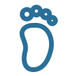

# Diabetes type 2

Bij diabetes type 2 zit er te veel suiker in je bloed. Vaak merk je daar niets van, maar op den duur kan het je bloedvaten, ogen, nieren en zenuwen beschadigen. Gezond leven, de controles en zo nodig medicijnen verkleinen die kans.

## 1. Wat gebeurt er in je lichaam?

Legenda: suiker, insuline (sleutel), lichaamscel.

### Stap 1: Gezond

#### Gezond

Als je eet, komt er **suiker** in je bloed. Die suiker is **brandstof** voor je lichaam.

Je **alvleesklier** maakt **insuline**. Insuline werkt als een **sleutel**: die zet het deurtje van je cellen open. Dan kan de suiker de cel in.

### Stap 2: Diabetes type 2

#### Diabetes type 2

Je lichaam reageert **minder goed op insuline**: het slot werkt slecht. Vaak maakt je alvleesklier ook **te weinig** insuline.

De suiker blijft in je bloed. Je bloedsuiker is **te hoog**. Meestal **merk je dat niet**.

Soms krijg je wel klachten, zoals veel dorst, veel plassen of moe zijn. Te zwaar zijn, weinig bewegen en roken maken de kans op diabetes type 2 groter.

### Stap 3: Na jaren

#### Na jaren te veel suiker

Heb je jarenlang een te hoge bloedsuiker? Dan kun je schade krijgen aan je **ogen**, **nieren**, **zenuwen** en **bloedvaten**.

Je kunt slechter gaan zien of **minder gevoel in je voeten** krijgen. En je hebt meer kans op een hartaanval of beroerte.

Daarom zijn de controles belangrijk, ook als je je goed voelt.

### Stap 4: Wat helpt

#### Wat helpt

**Bewegen** en **afvallen** laten je lichaam beter werken. Het slot gaat dan beter open en je bloedsuiker daalt.

**Medicijnen** helpen je bloedsuiker omlaag. Zo heb je minder kans op schade.

Leef je gezond? Dan heb je soms minder of geen medicijnen nodig.

## 2. Wat kun je zelf doen?

- **Beweeg** 5 dagen of meer per week stevig, een half uur per dag. Ben je te zwaar? Dan 1 uur per dag. Begin rustig, met 10 minuten per dag.
- Ben je te zwaar? **Een beetje afvallen** is al goed voor je.
- **Eet gezond**: veel groente, noten, bonen en volkoren producten. Fruit is ook gezond, maar eet niet meer dan 2 stuks per dag: er zit suiker in. Weinig witbrood, koek, snoep en kant-en-klaar eten.
- **Drink** vooral water, en thee en koffie zonder suiker. Liever geen frisdrank, vruchtensap of alcohol.
- **Rook je? Stop** dan met roken. Dat is extra belangrijk met diabetes.
- Zorg voor **ontspanning** en **goed slapen**. Stress en slecht slapen kunnen je bloedsuiker laten schommelen.

#### Gezond leven helpt echt

Het is de **basis** van de behandeling, ook als je medicijnen gebruikt. Je bloedsuiker en bloeddruk kunnen omlaag en je voelt je fitter.

#### Je hoeft het niet alleen te doen

De praktijkondersteuner of een diëtist helpt je. Er zijn ook leefstijlprogramma's: daar leer je gezonder eten, meer bewegen en dat volhouden.

Er is niet 1 speciaal dieet voor diabetes. Gaat het lastig met eten door stress of somberheid? Bespreek het: daar is ook hulp voor.

## 3. Medicijnen, en een te lage suiker

#### Eerst een pil

Meestal metformine

Deze pil maakt je bloedsuiker lager. In het begin kun je misselijk zijn of diarree hebben. Dat gaat meestal na een paar weken over.

#### Soms een tweede middel

Blijft je bloedsuiker te hoog? Dan krijg je er een medicijn bij. Vaak een pil waardoor je alvleesklier **meer insuline** maakt. Soms een andere pil of een spuit.

#### Soms insuline

Is je bloedsuiker dan nog te hoog? Dan kun je insuline erbij spuiten. De praktijkondersteuner of huisarts leert je hoe dat moet.

#### Elke dag innemen

Neem je medicijnen elke dag op **dezelfde tijd**, ook als je je goed voelt. Last van bijwerkingen? Bespreek het. **Stop niet zelf.**

Heb je ook een ziekte van hart, bloedvaten of nieren? Dan kan de keuze anders zijn. Soms krijg je ook medicijnen voor je bloeddruk of cholesterol. Je huisarts en jij kiezen samen.

#### Te lage bloedsuiker (hypo)

Dit kan vooral als je **insuline** spuit of een pil gebruikt die je alvleesklier **meer insuline** laat maken. Je huisarts vertelt of dat voor jou geldt.

#### Zo merk je het

- Honger, zweten, trillen.
- Duizelig zijn, hartkloppingen, gapen.
- In de war of onrustig zijn, opeens boos of verdrietig.
- Wazig zien of hoofdpijn.

#### Dit doe je meteen

- Eet **6 suikerklontjes** of 6 tabletten druivensuiker. Of drink een glas warm water met **2 eetlepels suiker**.
- Eet daarna **2 boterhammen** met zoet beleg, zoals jam.
- Meet je bloedsuiker na 15 minuten, na 1 uur en na 2 uur. Lager dan 3,9? **Bel direct**.

Twijfel je of het een hypo is? Neem dan toch suiker. Heb altijd suikerklontjes of druivensuiker bij je, en vertel je huisgenoten wat ze moeten doen.

## 4. Controles en je voeten

Ongeveer **3 keer per jaar** heb je controle bij de praktijkondersteuner of huisarts. Dat kan ook telefonisch of via video. **1 keer per jaar** is er een grotere controle in de praktijk.

-  hoe gaat het met je?
-  bloed: suiker en nieren
-  plas: eiwit
-  bloeddruk
-  gewicht
-  voeten
-  ogen: meestal elke 2 jaar

Meet je thuis je bloedsuiker, bloeddruk of gewicht? Schrijf het op en neem het mee. Ga je op vakantie of wil je vasten, zoals tijdens de ramadan? Bespreek het vooraf.

### Zorg goed voor je voeten

- **Kijk** regelmatig naar je voeten, ook **tussen je tenen**: wondjes, kloofjes, blaren.
- Draag goed passende **schoenen** en elke dag **schone sokken**.
- **Geen hete kruik**: je voeten kunnen verbranden.

## 5. Wanneer bellen?

#### **Spoed** — Bewusteloos

Iemand met diabetes is bewusteloos. **Bel 112.**

#### **Spoed** — Een hypo die niet overgaat

Je hebt suiker genomen, maar je bloedsuiker blijft lager dan 3,9. Of je blijft trillen, zweten of gapen. Of je raakt in de war of reageert niet goed meer. Of je wordt 's ochtends onrustig wakker, of je krijgt hoofdpijn en ziet wazig of dubbel, en suiker helpt niet. **Bel direct je huisarts of de huisartsenpost**, of laat iemand bellen.

Reageer je niet goed? Dan smeert een huisgenoot wat honing of stroop in je mond, aan beide kanten. Heb je glucagon in huis? Dan kan een huisgenoot dat geven.

#### **Spoed** — Ziek met weinig plassen

Je plast niet of heel weinig en je hebt dorst. Of je moet overgeven, of je ademt moeilijk. **Bel direct je huisarts of de huisartsenpost.**

Is je bloedsuiker hoger dan 15 en heb je een van deze klachten? Bel dan zeker meteen.

#### **Vandaag** — Ziek of een ontsteking

Je bent ziek met koorts, overgeven of diarree. Je hebt een ontsteking, zoals een blaasontsteking. Of je hebt opeens heel veel dorst. **Bel dezelfde dag.** Je hoort dan ook wat je met je medicijnen moet doen.

Slik je een pil waardoor je suiker uitplast? Stop die dan meteen als je koorts hebt, overgeeft, diarree hebt of weinig eet. En bel.

Slik je zo'n pil en heb je pijn en zwelling bij je vagina, je schaamlippen of je balzak? **Bel dezelfde dag.**

#### Afspraak maken

- Een wondje aan je voet dat niet geneest: bel **deze week**.
- Een blaar, eelt, ontsteking of voetschimmel aan je voet.
- Je bloedsuiker is vaak te hoog.
- Je hebt last van je medicijnen.
- Je maakt je zorgen of je hebt vragen.

---

Deze uitleg is algemeen. Wat voor jou geldt, bespreek je met je huisarts.

Tekst en tekeningen: Huisartsenpraktijk Tolgaarde / Socev, [CC BY-SA 4.0](https://creativecommons.org/licenses/by-sa/4.0/deed.nl).
