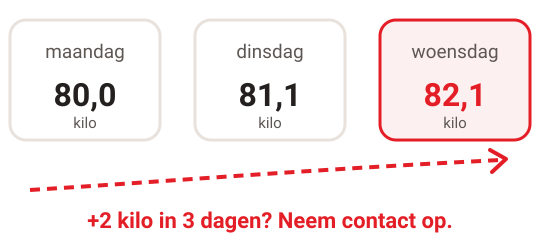

# Hartfalen

Bij hartfalen pompt je hart minder goed. Je lichaam krijgt minder bloed. En er kan vocht blijven hangen, in je longen en in je benen.

## 1. Het hart is een pomp

### Stap 1: Gezond hart

#### Een gezond hart

Je hart is een **pomp**. Het pompt bloed door je hele lichaam. Zo krijgen je spieren en organen zuurstof en voeding.

### Stap 2: Hartfalen

#### Hartfalen

Het hart pompt **minder goed**. Je wordt sneller moe en sneller buiten adem.

Het bloed stroomt ook minder goed terug. Er lekt **vocht** uit de bloedvaten: in je **longen** en in je **benen en enkels**.

's Nachts moet je vaak plassen. Hartfalen gaat meestal niet over. Maar je kunt er veel aan doen.

## 2. Weeg jezelf

*Voorbeeld.*

Weeg jezelf vaak, zoals je met je arts afspreekt. Bijvoorbeeld 's ochtends na het plassen, vóór het ontbijt.

Snel zwaarder? Dan houd je waarschijnlijk **vocht vast**. Misschien heb je even meer plaspillen nodig. Verander dat niet zelf: bel je huisarts of de hartfalenpoli, zoals je hebt afgesproken.

## 3. Wat doen de medicijnen?

#### Plaspillen

Werken snel: binnen een paar dagen

Je plast het extra vocht uit. Je wordt minder benauwd en je enkels worden dunner. Neem ze vóór 6 uur 's avonds.

#### Medicijnen waardoor je hart minder hard hoeft te werken

Langzaam opbouwen

Je hart hoeft minder hard te werken. Je begint met weinig en krijgt er stap voor stap meer van. In het begin kun je je wat slechter voelen. Daarna gaat het meestal beter.

#### Pil voor hart en bloedvaten

Veel mensen krijgen ook deze pil (een SGLT-2-remmer). Ben je ziek, met koorts, overgeven, diarree of weinig eten en drinken? Bel dan je arts. Soms moet je deze pil even stoppen.

#### Elke dag innemen

Ook als je je goed voelt. Dan wordt je hart minder snel slechter en is de kans kleiner dat je naar het ziekenhuis moet. Stop nooit zomaar, ook niet een paar dagen.

Je krijgt meestal een paar soorten tegelijk. Je arts kiest wat bij jou past.

## 4. Wat kun je zelf doen?

#### Gezond gewicht

Te zwaar? Afvallen helpt je hart. Eet wel genoeg en gezond.

#### Weinig zout

Zout houdt vocht vast. Doe geen zout bij je eten. Let op soep, pizza, chips en kant-en-klaarmaaltijden. Gebruik geen zoutvervanger met kalium.

#### Drinken

Drink verspreid over de dag, niet veel in één keer. Je arts zegt of je minder moet drinken.

#### Bewegen

Blijf bewegen, op een manier die bij jou past. Bijvoorbeeld elke dag wandelen.

#### Geen alcohol, niet roken

Allebei maken ze hartfalen erger. Hulp bij stoppen? Vraag het je huisarts.

#### Pas op met pijnstillers

Pijnstillers zoals ibuprofen, naproxen en diclofenac kunnen hartfalen erger maken. Paracetamol mag wel.

## 5. Wanneer bellen?

#### Bel je huisarts of de hartfalenpoli

- 2 kilo of meer zwaarder in 3 dagen.
- Je enkels worden steeds dikker.
- Je bent sneller moe of buiten adem.
- Veel vochtverlies door overgeven, diarree of zweten.

#### **Spoed** — Bel meteen

Je ademt opeens heel snel of moeilijk. Je bent opeens erg benauwd. Je kunt niet meer liggen van benauwdheid.

**Bel je huisarts, de huisartsenpost of 112.**

---

Deze uitleg is algemeen. Wat voor jou geldt, bespreek je met je huisarts.

Tekst en tekeningen: Huisartsenpraktijk Tolgaarde / Socev, [CC BY-SA 4.0](https://creativecommons.org/licenses/by-sa/4.0/deed.nl).
