# Hoge bloeddruk

Bij een hoge bloeddruk is de druk in je bloedvaten te hoog. Je merkt daar meestal niets van. Maar als het jaren zo blijft, krijg je meer kans op een ziekte van hart en bloedvaten. Gezond leven maakt je bloeddruk lager, en soms helpt een medicijn.

## 1. Wat is bloeddruk, en wat doet een hoge bloeddruk?

Legenda: bloed, wand van het bloedvat, te veel druk, lagere druk.

### Stap 1: Gewone bloeddruk

#### Gewone bloeddruk

Je **hart** pompt bloed door je bloedvaten. **Bloeddruk** is de druk in je bloedvaten.

Je bloeddruk bestaat uit **2 getallen**. Het hart knijpt samen: de druk is hoog, dat is de **bovendruk**. Het hart ontspant: de druk is lager, dat is de **onderdruk**.

Heb je net veel bewogen of veel stress? Dan is je bloeddruk hoger. Dat is normaal.

### Stap 2: Hoge bloeddruk

#### Hoge bloeddruk

Je hebt een hoge bloeddruk als je **bovendruk 140 of hoger** is. Ben je ouder dan 70? Dan is dat 150 of hoger.

Het bloed drukt dan harder tegen de wand van je bloedvaten. Je **merkt** daar meestal **niets** van.

Je bloeddruk wisselt. Daarom meet je of de huisartsenpraktijk vaker, soms ook thuis. Zo weet je of hij steeds te hoog is.

### Stap 3: Na jaren

#### Als het jaren zo blijft

Is je bloeddruk **jarenlang te hoog**? Dan heb je meer kans op een ziekte van hart en bloedvaten:

- een **beroerte**
- een **hartaanval** of pijn op de borst
- **nierschade**
- **etalagebenen** (pijn in je benen bij het lopen)

Niet iedereen met een hoge bloeddruk krijgt deze ziektes.

### Stap 4: Wat helpt

#### Wat helpt

**Gezond leven** maakt je bloeddruk lager. Dan wordt je risico ook kleiner.

Rook je? Dan is **stoppen met roken** het belangrijkst. Beweeg genoeg, eet weinig zout en drink geen alcohol.

Is je risico groot? Dan krijg je soms ook **medicijnen**. Die werken alleen als je ze elke dag neemt.

## 2. Het gaat om je totale risico

Een hoge bloeddruk is één van de dingen die je kans op een ziekte van hart en bloedvaten groter maken. Je huisarts kijkt naar **alles samen**.

#### Dit maakt je risico ook groter

- roken
- hoog cholesterol
- diabetes (suikerziekte) of nierschade
- te weinig bewegen, ongezond eten, te zwaar zijn
- stress

#### Wat de huisarts onderzoekt

Bloed en plas

In je bloed kijkt de huisarts naar je nieren, je bloedsuiker en je cholesterol. In je plas ook naar je nieren. Daarmee rekent de huisarts uit hoe groot je risico is.

#### Goed om te weten

Medicijnen zijn **niet altijd nodig**. Dat hangt af van je totale risico. Is je bovendruk hoger dan 180? Dan krijg je medicijnen.

Gezond leven helpt **altijd**, ook als je medicijnen neemt.

## 3. Zelf thuis je bloeddruk meten

### Zo meet je

- Gebruik een meter met een **band om je bovenarm**. Een polsmeter of smartwatch meet minder goed.
- Doe een half uur ervoor iets **rustigs**. Niet sporten, niet roken, geen koffie.
- Zit **rechtop** op een stoel, benen naast elkaar. Zit 5 minuten stil en **praat niet**.
- Leg je arm op tafel, met de band op de hoogte van je hart.
- Meet. Wacht 2 minuten en **meet nog een keer**. Gebruik altijd dezelfde arm.
- Schrijf de bovendruk, de onderdruk en je hartslag op.

#### Een week lang meten

Vaak vraagt je huisarts om 1 week te meten: **voor het ontbijt** en **2 uur na het avondeten**, elke keer 2 metingen. Daarna reken je het gemiddelde uit.

#### Goed bij thuis meten

Je gemiddelde bovendruk is **lager dan 135**. Ben je 70 of ouder: lager dan 145.

Een keer een hoge meting? Meet later nog eens. Vaak is hij dan lager.

Heb je met je huisarts iets anders afgesproken? Dan geldt dat. Neem je meter en je lijstje mee naar de afspraak.

## 4. Wat kun je zelf doen? En medicijnen

### Zelf doen

- Rook je? **Stop met roken**. Dat is het belangrijkst. Vraag hulp, dan lukt het vaker.
- **Beweeg** 2 en een half uur per week of meer. Bijvoorbeeld wandelen, fietsen of zwemmen. Zit minder lang stil.
- Eet **zo weinig mogelijk zout**. Zet geen zout op tafel. Kook met kruiden.
- Eet liever geen **drop** en drink niet veel zoethoutthee.
- Drink **geen alcohol**.
- Te zwaar? Probeer **af te vallen**. Vraag naar een leefstijlprogramma.
- Veel **stress**? Kijk waar het door komt. Je huisarts kan helpen.

### Medicijnen

#### Welk medicijn past bij jou?

Er zijn verschillende soorten. Ze maken allemaal de druk lager. Je huisarts kiest wat bij jou past.

#### Vaak 2 tegelijk

Is je bovendruk hoger dan 150? Dan begin je vaak met 2 soorten tegelijk. Na ongeveer 3 weken kijk je samen hoe het gaat. Soms is er ook bloedonderzoek.

#### Elke dag innemen

Je voelt een hoge bloeddruk niet. Neem je medicijnen dus ook als je je goed voelt. Stop nooit zomaar: dan gaat je bloeddruk weer omhoog.

Heb je last van bijwerkingen, bespreek het dan met je huisarts en stop niet zelf. Heb je nierschade, diabetes of hartfalen en word je ziek met hoge koorts, veel diarree of veel overgeven, bel dan je huisarts.

## 5. Wanneer bellen?

#### **Spoed** — Bel 112

- Je hebt pijn op je borst.
- Je hebt opeens veel pijn tussen je schouders.
- Je bent erg benauwd.
- Een arm of been is verlamd, je mond is scheef of je kunt opeens niet goed praten.

#### **Spoed** — Heel hoge of heel lage bloeddruk

- Bovendruk hoger dan 180 én klachten, zoals hoofdpijn, misselijk zijn, slecht zien of erg duizelig zijn.
- Bovendruk hoger dan 200, hoger dan je gewend bent, en hij blijft die dag zo hoog.
- Je onderdruk is hoger dan 120, hoger dan je gewend bent, en hij blijft die dag zo hoog.
- Je bovendruk is lager dan 90, en dat is veel lager dan je gewend bent.

**Bel meteen je huisarts of de huisartsenpost.**

#### Afspraak maken

- Je bovendruk is tussen 180 en 200, en hoger dan je gewend bent.
- Je gemiddelde bloeddruk is een week lang hoger dan je hebt afgesproken.
- Je hebt last van bijwerkingen van je medicijnen.

---

Deze uitleg is algemeen. Wat voor jou geldt, bespreek je met je huisarts.

Tekst en tekeningen: Huisartsenpraktijk Tolgaarde / Socev, [CC BY-SA 4.0](https://creativecommons.org/licenses/by-sa/4.0/deed.nl).
