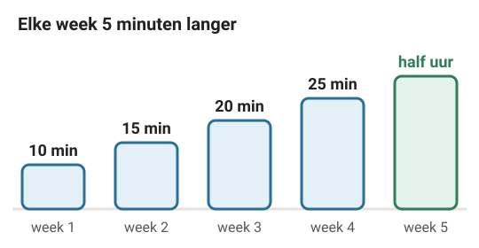

# Artrose in je knie

Bij artrose in je knie wordt het kraakbeen dunner en minder glad. Je knie kan pijn doen en stijf voelen. Artrose gaat niet over, maar je kunt er veel aan doen: blijf bewegen, maak je spieren sterker en val af als je te zwaar bent.

## 1. Wat gebeurt er in je knie?

Legenda: bot, kraakbeen, spier, vocht.

### Stap 1: Gezonde knie

#### Een gezonde knie

In je knie komen het **dijbeen** en het **scheenbeen** samen. De knieschijf zit aan de voorkant.

Op de uiteinden van de botten zit een laagje **kraakbeen**. Dat is heel glad. Zo kun je je knie makkelijk buigen en strekken.

De bovenbeenspier zit aan de voorkant van je bovenbeen. Die spier helpt je knie te strekken.

### Stap 2: Artrose

#### Artrose

Bij artrose wordt het kraakbeen **dunner** en het is **niet glad meer**. Je knie gaat pijn doen en bewegen gaat moeilijker.

Als je langer artrose hebt, groeit er **extra bot** aan de randen. Je knie wordt dan breder.

Soms raakt je knie ontstoken. Dan doet hij meer pijn en kan hij dik worden. Veel mensen noemen artrose ook wel slijtage.

### Stap 3: Bewegen en sterke spieren

#### Bewegen en sterke spieren

Door te bewegen worden je spieren **sterker**. Je knie voelt dan **steviger** en minder stijf. Vaak wordt de pijn ook minder.

Een beetje extra pijn als je meer gaat bewegen is normaal. **De artrose wordt er niet erger van.**

Artrose gaat niet over. Maar met bewegen en oefenen heb je vaak minder last.

### Stap 4: Minder gewicht

#### Minder gewicht

Je knie draagt je **gewicht**. Bij elke stap en op de trap.

Ben je te zwaar? Als je afvalt, hoeft je knie **minder gewicht** te dragen. Je kunt dan minder pijn hebben.

Een diëtist of een leefstijlprogramma kan je helpen om af te vallen.

## 2. Wat merk je? En hoe weet je dat het artrose is?

#### Wat je kunt merken

- Je knie doet pijn en voelt stijf. Vooral 's ochtends, of als je een tijdje hebt gezeten.
- Als je gaat lopen, wordt de pijn meestal minder.
- Pijn als je de knie zwaar gebruikt, zoals bij traplopen.
- Hurken of knielen gaat moeilijker.

#### Meestal geen foto nodig

De huisarts stelt je vragen en onderzoekt je knie. Dan weet de huisarts meestal of het artrose is.

Een röntgenfoto is meestal **niet nodig**. Artrose is niet altijd op een foto te zien. En een foto laat niet zien hoeveel pijn je hebt.

#### De pijn wisselt

Artrose gaat niet over

Maar je hebt niet altijd pijn. Je kunt weken of maanden weinig pijn hebben, en dan weer een tijdje meer.

## 3. Wat kun je zelf doen?

- **Beweeg elke dag een half uur**. Bijvoorbeeld wandelen, fietsen of zwemmen. 2 keer een kwartier mag ook.
- Doe **oefeningen** die je bovenbeenspieren sterker maken. Bijvoorbeeld om de dag.
- Een beetje extra pijn na het bewegen is **normaal**. Veel meer pijn? Doe het de volgende keer rustiger aan, maar blijf bewegen.
- Ben je te zwaar? Probeer **af te vallen**.
- Sporten mag. Begin rustig en bouw langzaam op.

*Voorbeeld. Is een half uur nog te veel? Begin dan met 5 of 10 minuten per dag.*

#### Fysiotherapeut

Lukt bewegen of oefenen niet goed alleen? Een fysiotherapeut of oefentherapeut legt de oefeningen uit. Blijf ze ook thuis doen.

#### Een tijd veel pijn?

Steun dan een tijd minder op je knie, met krukken, een wandelstok of een rollator. Een stok houd je in de hand aan de andere kant. Blijf je knie wel bewegen.

#### Goed om te weten

Bewegen en sporten zijn **veilig** bij artrose. Ze maken de artrose niet erger. Wie blijft bewegen, heeft vaak minder pijn.

## 4. Pijnstillers, een prik en later

Pijnstillers maken de artrose niet beter. Ze kunnen wel helpen om **te blijven bewegen**.

#### 1. Paracetamol

Begin hiermee

Werkt goed en heeft de minste bijwerkingen. Heb je elke dag pijn? Neem hem dan op vaste tijden, en wacht niet tot je pijn hebt.

#### 2. Gel op je knie

Pijnstiller om op te smeren

Een gel met een ontstekingsremmende pijnstiller. Wrijf hem zacht in op je knie.

#### 3. Pijnstiller tegen ontsteking

Liefst kort, als het even slechter gaat

Ze helpen goed tegen pijn, maar kunnen ernstige bijwerkingen hebben. Overleg met je huisarts of apotheek.

### Helpt het niet genoeg?

#### Prik in je knie

Als het andere niet genoeg helpt

De huisarts spuit een medicijn tegen ontsteking in je knie. Dat helpt meestal een paar weken. Je mag niet vaak een prik krijgen: hooguit 4 keer per jaar, met minstens 6 weken ertussen.

#### Later: een nieuwe knie?

Blijf je veel klachten houden, ook na bewegen, oefenen en pijnstillers? Kun je heel moeilijk lopen of slaap je slecht van de pijn? Dan kan de huisarts je doorsturen naar de orthopeed. Samen kijk je of een **kunstknie** kan helpen.

#### Wat helpt niet?

- Middelen van de drogist, zoals glucosamine, chondroïtine of kurkuma. Artsen raden ze af.
- Een kniebrace of inlegzolen. Het is niet bewezen dat die helpen.
- Een kijkoperatie om de knie 'schoon te maken'. Dat helpt niet bij artrose. Alleen als je knie op slot zit, kan een kijkoperatie soms helpen.

## 5. Wanneer bellen?

#### **Spoed** — Pijnlijke knie en koorts

Je knie doet pijn en je voelt je ziek of je hebt koorts. Zeker als je knie ook dik, warm of rood is. **Bel direct je huisarts of de huisartsenpost.**

#### **Vandaag** — Dikke, warme, rode knie

Je knie wordt opeens dik, warm en rood, ook zonder koorts. Zeker als dat gebeurt in de dagen na een prik in je knie. **Bel dezelfde dag je huisarts.**

#### **Vandaag** — Niet meer op je been staan

Je kunt opeens niet meer op je been staan. **Bel dezelfde dag je huisarts.**

#### Afspraak maken

- Je hebt opeens meer pijn, of de klachten worden steeds erger.
- Je knie is erg dik geworden.
- Je kunt je knie opeens niet meer strekken: je knie zit op slot.
- Je doet wat je kunt, maar je hebt nog steeds veel pijn.
- Je wilt hulp bij meer bewegen, oefenen of afvallen.

---

Deze uitleg is algemeen. Wat voor jou geldt, bespreek je met je huisarts.

Tekst en tekeningen: Huisartsenpraktijk Tolgaarde / Socev, [CC BY-SA 4.0](https://creativecommons.org/licenses/by-sa/4.0/deed.nl).
