# Lage rugpijn

Pijn in je onderrug is heel gewoon. Meestal is er niets kapot en gaat de pijn vanzelf over. Blijf zo veel mogelijk bewegen: dat helpt je juist om beter te worden.

## 1. Wat gebeurt er in je rug?

Legenda: wervel, tussenwervelschijf, zenuw, rugspieren.

### Stap 1: Gezonde rug

#### Een gezonde rug

Je rug bestaat uit botjes op elkaar: de **wervels**. Daartussen zitten zachte kussentjes: de **tussenwervelschijven**.

Achter de wervels lopen **zenuwen**. Eén grote zenuw loopt van je onderrug naar je been. Je **rugspieren** houden je rug stevig en laten hem bewegen.

### Stap 2: Gewone rugpijn

#### Gewone rugpijn

Meestal is **niet duidelijk** waar rugpijn door komt. Spieren, banden, botten en zenuwen in je onderrug werken even niet goed samen. Je spieren zijn vaak **gespannen**.

Je rug is gevoelig, maar er is **niets kapot**. Artsen noemen dit gewone rugpijn. Het gaat meestal vanzelf over.

De pijn kan heel heftig zijn. Soms voel je hem ook in je bovenbeen.

### Stap 3: Hernia

#### Een hernia

Soms heeft een tussenwervelschijf een zwakke plek. De zachte gel in de schijf komt dan naar buiten en **drukt op een zenuw**. Dat heet een hernia.

Je voelt dan vooral een scherpe **pijn in je bil of been**, tot in je onderbeen en soms tot in je voet.

Je been kan branden, prikken of doof voelen. Hoesten, niezen of persen kan meer pijn geven.

### Stap 4: Bewegen helpt

#### Bewegen helpt

Met bewegen kun je **niets kapot maken**. Het helpt juist om beter te worden, ook als je pijn hebt.

Als je beweegt en je spieren rekt, **ontspannen** ze. Je rug wordt soepeler en vaak heb je minder pijn.

Ook bij een hernia: blijf bewegen. Dan blijven je spieren sterk en soepel.

## 2. Gewone rugpijn of hernia: hoe lang duurt het?

#### Gewone rugpijn

De meeste mensen met rugpijn

- Pijn in je onderrug, soms ook in je bovenbeen.
- Er is geen schade en geen hernia.
- Meestal binnen 4 weken minder pijn.

#### Hernia

Een schijf drukt op een zenuw

- Vooral pijn in je bil of been, tot in je onderbeen.
- Als je ligt, heb je meestal minder pijn.
- Bij 3 van de 4 mensen gaat de pijn in het been binnen 3 maanden vanzelf over.

#### Goed om te weten

Rugpijn kan terugkomen. Ook dan gaat de pijn vaak **vanzelf** weer weg.

Gaat een hernia niet over? Dan kun je met je huisarts kiezen: langer afwachten of een behandeling in het ziekenhuis.

## 3. Wat kun je zelf doen? En pijnstillers

### Blijf bewegen

- Doe zo veel mogelijk je **gewone dingen**: huishouden, werk en hobby's.
- Beweeg **elke dag een half uur** of langer. Bijvoorbeeld wandelen, fietsen of zwemmen. Ook als je veel pijn hebt.
- Zit niet lang stil. Sta na 15 minuten zitten even op of loop een stukje.
- Ga overdag **niet in bed** liggen. Dan worden je spieren slapper. De eerste dagen een paar uur liggen mag, als dat de minste pijn geeft.
- Til met **gebogen knieën** en houd het dicht bij je lichaam. Draai en buig niet tegelijk.
- Je rug **warm houden** kan fijn zijn.

#### Pijnstillers

Door een pijnstiller gaat de pijn **niet sneller weg**. Maar je kunt er soms wel makkelijker door bewegen.

Begin met **paracetamol**: dat geeft de minste bijwerkingen. Ook een gel met pijnstiller op je rug kan.

Helpt dat niet genoeg? Dan kun je er een ontstekingsremmende pijnstiller bij nemen. Gebruik die zo kort mogelijk. Neem nooit 2 soorten ontstekingsremmers tegelijk. Niet iedereen kan die gebruiken: vraag het je huisarts of apotheek.

#### Werk

Zwaar werk, of lukt je werk niet goed door de pijn? Bespreek met je werkgever en de bedrijfsarts hoe je kunt blijven werken.

#### Oefeningen en fysiotherapie

Oefeningen maken je rug soepeler en sterker. Heb je pas kort rugpijn, dan is fysiotherapie niet nodig. Lukt het na een paar weken niet om meer te doen, of durf je niet te bewegen? Dan kan een fysio- of oefentherapeut helpen.

Medicijnen die je spieren slapper maken, helpen niet bij rugpijn.

## 4. Een foto of scan?

Een röntgenfoto of scan is bij rugpijn **meestal niet nodig**. Je huisarts stelt vragen en onderzoekt je. Meestal is dat genoeg.

#### Gewone rugpijn

De oorzaak is bijna nooit op een foto of scan te zien. Wat er soms wel op te zien is, past vaak niet bij je pijn. En het verandert niets aan wat helpt.

#### Hernia

Ook dan hoef je eerst geen foto of MRI. Voor de behandeling in de eerste weken maakt het niet uit wat er op een scan te zien is.

#### Wat wel helpt

Blijven bewegen en je gewone dingen doen. Je huisarts let op signalen dat er iets anders aan de hand is.

## 5. Wanneer bellen?

#### **Spoed** — Plas of poep gaat mis

Je kunt niet meer plassen, terwijl je wel moet. Of je kunt je plas of poep niet meer ophouden. **Bel direct je huisarts of de huisartsenpost.**

#### **Spoed** — Doof tussen je benen

Je hebt minder of geen gevoel bij je penis of vagina en je anus. **Bel direct je huisarts of de huisartsenpost.**

#### **Spoed** — Been opeens zwakker

Op je tenen of hielen staan lukt niet meer. **Bel direct je huisarts of de huisartsenpost.**

#### **Spoed** — Heel veel pijn of flauw

Je hebt opeens heel veel rugpijn en buikpijn. Of je bent duizelig, je zweet en voelt je flauw. **Bel direct je huisarts of de huisartsenpost.**

#### **Vandaag** — Rugpijn en koorts

Je hebt rugpijn en koorts. **Bel dezelfde dag je huisarts of de huisartsenpost.**

#### **Werkdag** — Bel je huisarts

- Je bent gevallen en hebt daarna pijn in je onderrug.
- Je hebt kanker of je hebt kanker gehad.
- Je bent kleiner of krommer geworden.
- Je valt af zonder dat je dat wilt.
- De pijn wordt niet minder als je ligt, ook 's nachts niet.
- Je hebt een operatie of prik in je rug gehad, en na 2 weken heb je nog rugpijn. Bel dan de arts die jou behandeld heeft.

#### Afspraak maken

- De pijn is na 1 maand nog niet minder.
- Je houdt erge pijn, ook met pijnstillers.
- Na een paar weken nog veel pijn in je been, en je gewone dingen lukken niet.

---

Deze uitleg is algemeen. Wat voor jou geldt, bespreek je met je huisarts.

Tekst en tekeningen: Huisartsenpraktijk Tolgaarde / Socev, [CC BY-SA 4.0](https://creativecommons.org/licenses/by-sa/4.0/deed.nl).
