# Meniscusklachten

In je knie zitten 2 schijfjes van kraakbeen. Elk schijfje heet een meniscus. Zo'n schijfje kan scheuren. Dat gebeurt door een draaibeweging, of langzaam door slijtage. Meestal gaat het vanzelf beter. Blijf bewegen en doe steeds iets meer.

## 1. Wat is de meniscus?

Legenda: bot, kraakbeen, meniscus, scheur, vocht.

### Stap 1: Gezonde knie

#### Een gezonde knie

Tussen je **dijbeen** en je **scheenbeen** liggen 2 schijfjes kraakbeen. Elk schijfje heet een **meniscus**: de binnen-meniscus en de buiten-meniscus.

Ze werken als een **schokdemper**. En ze helpen je knie soepel te bewegen.

### Stap 2: Scheur na een draai

#### Scheur na een draai

Je **voet staat stil** en je knie **draait**. Bijvoorbeeld bij sporten. Dan kan de meniscus scheuren.

Je knie doet pijn, vooral aan de binnenkant of de buitenkant. Vaak wordt hij **dik**.

Bij een flinke draai kunnen ook de banden in je knie beschadigd zijn. De huisarts onderzoekt dat.

### Stap 3: Knie op slot

#### Knie op slot

Soms klapt er een **los stukje** van de meniscus naar het midden. Het komt **klem** te zitten.

Je kunt je knie dan opeens **niet meer helemaal strekken**. Dat doet pijn.

Lukt het niet om je knie los te krijgen? **Bel dezelfde dag je huisarts.**

### Stap 4: Slijtage

#### Slijtage

Als je ouder wordt, wordt de meniscus **minder sterk**. Er komen **kleine scheurtjes** in. Vaak zonder dat je iets verkeerd hebt gedaan.

Soms heb je er ook [artrose](../knieartrose/tekst.md) bij: het kraakbeen op de botten wordt dunner.

Bewegen en oefenen helpen het meest. Een operatie helpt meestal niet.

## 2. Na een draai of door slijtage?

#### Na een draaibeweging

Vaak jonger, vaak bij sporten

- Het begint **opeens**, met een verkeerde beweging of een klap.
- Veel pijn. Je kunt je knie moeilijk bewegen.
- Vaak wordt je knie dik, soms pas de volgende dag. Wordt hij binnen 2 uur al heel dik, soms ook blauw? **Bel dan dezelfde dag.**
- Soms schiet je knie **op slot**.

#### Door slijtage

Meestal ouder dan 35

- De pijn komt **langzaam** of vanzelf. Je hebt je knie niet verdraaid.
- De pijn wisselt: soms veel, dan weer een paar dagen minder.
- Meestal is je knie niet dik.
- Pijn bij hurken of bij draaien met je voet op de grond.

#### Meestal geen foto of scan

De huisarts stelt vragen, kijkt naar je knie en beweegt hem. Een foto of scan is meestal **niet nodig**. Wat je erop ziet, verandert meestal niets aan wat helpt.

Is je knie erg dik? Dan kan de huisarts hem moeilijk onderzoeken. De huisarts vraagt je dan na 1 week terug te komen.

Denkt de huisarts dat er iets gebroken is? Dan krijg je een röntgenfoto. Is er meer kapot, of zit je knie op slot? Dan stuurt de huisarts je naar de **orthopeed**: de specialist voor botten en gewrichten.

## 3. Na een draaibeweging: wat kun je doen?

Is er verder geen erge schade in je knie? Dan gaat het **meestal vanzelf beter**. Hoe beter je blijft bewegen, hoe sneller.

#### De eerste dagen

- Geef je knie een paar dagen rust. Buig en strek hem wel af en toe. Kleine stukjes lopen mag.
- Krukken kunnen helpen. Die kun je huren of lenen bij een thuiszorgwinkel.
- Koelen kan de pijn minder maken. Wikkel het ijs in een doek.
- Leg je been hoog als je zit, bijvoorbeeld op een stoel. Leg geen kussen onder je knie zelf: dat kan het herstel vertragen.

#### Weer meer bewegen

- Bewegen is veilig, ook als er later meer schade blijkt.
- Doe **elke week iets meer**. Niet ineens te veel: dan krijg je weer meer pijn.
- Oefeningen voor je **bovenbeenspieren** helpen. Sterke spieren geven je knie steun.
- Rennen gaat nog niet? Fietsen of zwemmen gaat vaak wel.

#### Pijnstillers

Begin met **paracetamol**. Dat werkt meestal goed en heeft de minste bijwerkingen.

Je kunt ook een **gel met een pijnstiller** op je knie smeren. Helpt het niet genoeg? Overleg met je huisarts of apotheek.

#### Knie op slot?

Probeer hem los te krijgen: ga even liggen, laat je been hangen, of buig en strek je been voorzichtig.

Kun je je been daarna nog steeds niet strekken? **Bel dezelfde dag je huisarts.**

#### Een kniebrace?

Mag, als het prettig voelt. Je knie geneest er niet sneller van. Draag hem niet langer dan 4 weken.

#### Een operatie?

Meestal niet nodig. Soms wel: na een flinke klap of een ongeluk, als je knie **op slot** zit of vaak op slot schiet, of als je veel last houdt. De orthopeed kan de meniscus soms **hechten**, of een stukje weghalen.

## 4. Door slijtage: wat helpt?

Een meniscus met slijtage hoort vaak bij **ouder worden**. Met bewegen en oefenen krijg je meestal minder last. Dat kan een paar maanden duren.

#### Blijf bewegen

Dit helpt het meest

Wandel en fiets elke dag. Doe oefeningen die je **bovenbeenspieren** sterker maken. Een beetje extra pijn na het bewegen is normaal en kan geen kwaad.

#### Fysiotherapeut

Lukt bewegen of oefenen niet goed alleen? Een fysiotherapeut of oefentherapeut kan je helpen. Blijf de oefeningen ook thuis doen.

#### Te zwaar?

Probeer af te vallen. Dan komt er minder gewicht op je knie. Dat kan de klachten minder maken.

#### Een kijkoperatie helpt meestal niet

Bij slijtage helpt een kijkoperatie meestal **niet beter** dan bewegen en oefenen. Alleen als je knie echt op slot zit, kan een kijkoperatie soms helpen.

#### Pijnstillers

Begin met **paracetamol**. Een gel met een pijnstiller op je knie kan ook. Pijnstillers helpen je om te blijven bewegen.

#### Ook artrose?

Soms zit er bij slijtage van de meniscus ook artrose in de knie. Dan helpt dezelfde aanpak. Lees verder bij [artrose in je knie](../knieartrose/tekst.md).

## 5. Wanneer bellen?

#### **Spoed** — Pijnlijke knie en koorts

Je knie is dik, warm of rood, en je hebt koorts of je voelt je ziek. **Bel direct je huisarts of de huisartsenpost.**

#### **Vandaag** — Knie op slot

Je kunt je been niet meer strekken, ook niet na liggen of hangen. **Bel dezelfde dag je huisarts of de huisartsenpost.**

#### **Vandaag** — Na een val of ongeluk

- Je kunt helemaal niet op je been staan.
- Je knie wordt binnen 2 uur heel dik, soms ook blauw.
- Je kunt je been niet gestrekt optillen.
- Je knie heeft een harde klap gehad, bijvoorbeeld bij een ongeluk.

**Bel dezelfde dag je huisarts of de huisartsenpost.**

#### Afspraak maken

- Je knie is na 1 week nog dik, of doet nog veel pijn.
- Je knie heeft op slot gezeten.
- Je hebt het gevoel dat je **door je knie zakt**.
- Het lukt na een paar weken niet om meer te bewegen of te sporten.
- Je doet je oefeningen, maar je houdt veel last.

---

Deze uitleg is algemeen. Wat voor jou geldt, bespreek je met je huisarts.

Tekst en tekeningen: Huisartsenpraktijk Tolgaarde / Socev, [CC BY-SA 4.0](https://creativecommons.org/licenses/by-sa/4.0/deed.nl).
