# Prostaat: goedaardige vergroting en prostaatkanker

Veel mannen moeten vaker plassen als ze ouder worden, of hebben een zwakkere straal. Dat is vervelend, maar meestal niet gevaarlijk. Plasklachten zijn bijna nooit een teken van prostaatkanker.

## 1. Waar zit de prostaat en wat gebeurt er?

Legenda: plas, prostaat, kanker.

### Stap 1: Gewone prostaat

#### Een gewone prostaat

De prostaat zit **onder je blaas**, **rond de plasbuis**. Hij is zo groot als een kastanje.

Je plas stroomt van de blaas door de plasbuis naar buiten. De plasbuis loopt dwars door het **midden** van de prostaat.

De prostaat maakt het vocht waarin zaadcellen zwemmen.

### Stap 2: Grotere prostaat

#### Een grotere prostaat

Als je ouder wordt, wordt de prostaat vaak **groter**. Dat is **goedaardig**: het is geen kanker.

Een grotere prostaat kan op de plasbuis **drukken**. Dan kan je straal zwakker worden, druppel je na of moet je vaker plassen, ook 's nachts.

Niet elke man met een grotere prostaat heeft daar last van. En plasklachten komen vaak ook door andere dingen.

### Stap 3: Prostaatkanker

#### Prostaatkanker

Prostaatkanker groeit meestal aan de **buitenkant** van de prostaat. De plasbuis zit in het midden.

Daarom drukt prostaatkanker bijna nooit op de plasbuis. Prostaatkanker geeft meestal **geen plasklachten**, en vaak helemaal geen klachten.

Alleen als de kanker al ver gegroeid is, geeft hij soms klachten.

### Stap 4: Ook blaas en bekkenbodem

#### Meestal meer dingen tegelijk

Plasklachten komen meestal door **meer dingen tegelijk**, niet alleen door de prostaat:

- De **blaasspier** werkt minder goed.
- De **bekkenbodemspieren** zijn te slap of te gespannen.
- De prostaat drukt op de plasbuis.
- Harde poep, te zwaar zijn, veel koffie of alcohol, of sommige medicijnen.

## 2. Grotere prostaat of prostaatkanker: het verschil

#### Grotere prostaat

Goedaardig, geen kanker

- Heel gewoon bij het ouder worden.
- Kan op de plasbuis drukken.
- Kan plasklachten geven, maar dat hoeft niet.

#### Prostaatkanker

Meestal aan de buitenkant

- Geeft meestal geen klachten.
- Groeit meestal langzaam. Vaak is behandelen dan niet nodig.
- Soms groeit hij sneller. Dan is vaak wel behandeling nodig.

#### Goed om te weten

Plasklachten zijn **geen teken van prostaatkanker**. Bij 1 van de 3 mannen gaan plasklachten vanzelf over.

## 3. Wat kun je zelf doen? En medicijnen

### Zelf doen

- Neem de **tijd** om te plassen. Probeer te ontspannen en **niet te persen**.
- Probeer of plassen **zittend of staand** beter gaat.
- **Beweeg** genoeg en eet **vezels**, zodat je poep zacht blijft.
- Probeer **2 weken geen koffie of alcohol**. Helpt het? Drink er dan minder van.
- Vaak 's nachts plassen? Drink 's avonds minder en de laatste **2 uur** voor het slapen niets.
- Nadruppelen? Duw na het plassen met je vinger de plasbuis leeg, van de balzak naar de punt van je penis.

### Helpt dat niet genoeg?

#### Oefeningen

Oefeningen voor je bekkenbodemspieren. Soms met hulp van een bekken-fysiotherapeut.

#### Medicijnen

Bij een zwakke straal of nadruppelen: een medicijn dat de spieren in de prostaat en plasbuis ontspant. Bij steeds heel nodig moeten: een medicijn waardoor er meer plas in je blaas past.

Medicijnen maken de klachten minder, maar meestal niet helemaal weg. Probeer ze eerst 6 weken. Middelen met dwergpalm of zaagpalm uit de winkel helpen waarschijnlijk niet.

## 4. Testen op prostaatkanker (PSA)

Heb je alleen plasklachten? Dan is een bloedtest op prostaatkanker (PSA) **niet nodig**.

Denk je erover om je toch te laten testen? Dat mag je zelf kiezen. Testen heeft voordelen en nadelen. Bespreek het met je huisarts. De test is bloed prikken (PSA). Soms voelt de huisarts ook via de anus aan je prostaat.

#### Voordelen

- Is de uitslag goed? Dan maak je je minder zorgen.
- Soms wordt snel groeiende kanker vroeg gevonden. Die kans is klein.

#### Nadelen

- Is de uitslag niet goed? Dan volgen meer onderzoeken. Vaak blijkt dan dat je toch geen kanker hebt.
- Je kunt behandeld worden voor kanker die nooit klachten had gegeven. Een behandeling kan blijvende klachten geven, zoals plas verliezen of moeite met een stijve penis.

#### Goed om te weten

Mannen die zich laten testen, leven gemiddeld even lang als mannen die zich niet laten testen.

Zit er een erfelijke fout in je BRCA2-gen? Dan raden huisartsen testen meestal wel aan, vanaf een bepaalde leeftijd.

Ben je 75 jaar of ouder, of ernstig ziek? Dan krijg je meestal geen test.

## 5. Wanneer bellen?

#### **Spoed** — Je kunt opeens niet plassen

Je moet heel nodig, maar het lukt niet. Ook niet als je rustig op de wc zit. **Bel direct je huisarts of de huisartsenpost.**

#### **Spoed** — Pijn bij plassen en koorts

Plassen doet pijn en je bent ook ziek of hebt koorts. Dit kan een ontsteking zijn. **Bel direct je huisarts of de huisartsenpost.**

#### **Vandaag** — Vaak plassen en het doet pijn

Dit kan een blaasontsteking zijn. Mannen krijgen daar altijd antibiotica voor. **Bel dezelfde dag.**

#### Afspraak maken

- Er zit bloed in je plas.
- Er komt pus of ander vocht uit je penis.
- Je plast vooral 's nachts heel vaak en je bent ook benauwd.
- Je kunt niet goed uitplassen, plast heel vaak kleine beetjes én kunt je plas niet ophouden.
- Je hebt veel last, of je maakt je zorgen over prostaatkanker.

---

Deze uitleg is algemeen. Wat voor jou geldt, bespreek je met je huisarts.

Tekst en tekeningen: Huisartsenpraktijk Tolgaarde / Socev, [CC BY-SA 4.0](https://creativecommons.org/licenses/by-sa/4.0/deed.nl).
