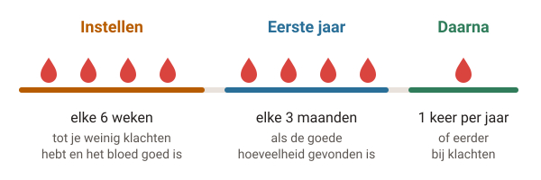

# Te langzaam werkende schildklier

Je schildklier maakt een hormoon dat je lichaam op tempo houdt. Werkt hij te langzaam, dan ben je bijvoorbeeld moe, heb je het snel koud of word je zwaarder. Een tablet met schildklier-hormoon vult aan wat je tekortkomt: elke dag, meestal je hele leven.

## 1. Wat doet je schildklier en wat gebeurt er?

Legenda: schildklier-hormoon in je bloed, TSH: seintje van je hersenen, schildklier.

### Stap 1: Gewone schildklier

#### Een gewone schildklier

Je schildklier zit **in je hals**, aan de voorkant. Hij heeft de vorm van een vlinder.

Hij maakt **schildklier-hormoon**. Dat gaat met je bloed naar je hele lichaam. Het helpt je lichaam om **energie** te halen uit je eten.

Je hersenen houden in de gaten of er genoeg hormoon is. Ze geven je schildklier een seintje met het hormoon **TSH**.

### Stap 2: Te langzaam

#### Je schildklier werkt te langzaam

Je schildklier maakt **te weinig hormoon**. Dan gaat **alles in je lichaam langzamer**.

Je kunt het snel koud hebben, moe zijn, zwaarder worden of moeilijk poepen. Je huid en haar kunnen droog worden.

Je hersenen maken dan juist **meer TSH**. Dat zie je in je bloed: weinig schildklier-hormoon en veel TSH.

Meestal komt het door de **ziekte van Hashimoto**. Je afweer valt dan je eigen schildklier aan.

### Stap 3: Met het tablet

#### Met het tablet

Je slikt elke dag een **tablet met schildklier-hormoon**. Het werkt hetzelfde als het hormoon van je eigen schildklier.

Zo komt er weer **genoeg hormoon** in je bloed. Na **een aantal weken** merk je dat het helpt.

Je schildklier zelf gaat er niet beter van werken. Daarom slik je het tablet meestal **je hele leven**.

## 2. Het tablet: zo neem je het in

- **1 keer per dag**, met water.
- Steeds rond **dezelfde tijd**.
- Op een **lege maag**: een half uur vóór je ontbijt. Of vanaf 2 uur na je avondeten.
- Elke dag, ook als je je goed voelt.
- Gebruik steeds **hetzelfde merk**. Krijg je van de apotheek toch een ander merk en krijg je klachten? Bespreek het met je huisarts.

Het middel heet levothyroxine. Het is je eigen hormoon, maar dan als tablet.

#### Let op met andere middelen

Sommige middelen laten het tablet minder goed werken, zoals **ijzer**, **kalk (calcium)**, magnesium en middelen die **maagzuur binden** (kauwtabletten tegen maagzuur). Neem die minstens 2 uur eerder of later in.

Ook **zeewier, kelp, visolie-capsules** en multivitamines met jodium kunnen invloed hebben. Vertel je huisarts of apotheker welke middelen je gebruikt.

#### Trombosedienst

Kom je bij de trombosedienst? Vertel daar dat je dit tablet gaat slikken. En ook als je meer of minder gaat slikken.

#### Goed om te weten

- Een te langzaam werkende schildklier is **goed te behandelen**. De meeste mensen hebben geen klachten als ze de goede hoeveelheid blijven slikken.
- Zelf kun je niets doen om je schildklier sneller te laten werken. Het tablet doet dat werk.
- Het duurt **een aantal weken** voor je merkt dat het helpt.

## 3. Bloed prikken en controle

Hoeveel hormoon jij nodig hebt, is voor iedereen anders. Dat zoek je samen met je huisarts uit, met **bloed prikken**.

### Het instellen

- Elke 6 weken laat je bloed prikken. Daarna ga je voor controle naar je huisarts.
- Soms ga je daarna **meer of minder** slikken. Dat hangt af van je klachten en de uitslag.
- Heb je een hartziekte? Dan begin je soms met een kleine hoeveelheid en bouw je langzaam op.
- Het zoeken naar de goede hoeveelheid kan soms **maanden** duren.

### Bij het bloed prikken

- Ga op een **vast tijdstip**, als het kan **vóór** je je tablet slikt.
- Ga als het kan steeds naar **dezelfde plek**.
- Krijg je tussendoor klachten? Maak dan zelf een afspraak voor controle.

## 4. Zwanger worden of zwanger zijn

Je baby gebruikt in het begin van de zwangerschap **jouw schildklier-hormoon**. Daarom is genoeg hormoon in je bloed belangrijk, voor je baby en voor jezelf.

#### Wil je zwanger worden?

Maak eerst een afspraak met je huisarts. Je huisarts controleert je bloed en zegt of je meer of minder moet slikken.

Is de hoeveelheid hormoon in je bloed goed? Dan kun je veilig zwanger worden.

#### Ben je zwanger?

**Vertel het meteen aan je huisarts.** Je hebt vanaf het begin **meer** van je tablet nodig. Je huisarts zegt hoeveel.

Je laat dan vaker bloed prikken: in de eerste helft van de zwangerschap elke 4 weken, daarna elke 6 weken.

#### Na de bevalling

Vaak slik je dan weer net zoveel als vóór je zwangerschap. Zes weken na de bevalling laat je bloed prikken.

Borstvoeding geven mag. Het tablet is niet gevaarlijk voor je baby.

## 5. Wanneer bellen?

#### **Spoed** — Bel 112

Je hebt een **zwaar, drukkend gevoel** op je borst, en je zweet of bent misselijk.

#### **Vandaag** — Klachten van te veel hormoon

- Je hebt pijn of druk op je borst.
- Je hart klopt veel sneller.
- Je bent onrustig, angstig of snel geïrriteerd.
- Je zweet veel, slaapt slecht of hebt hoofdpijn of diarree.
- Je valt af, terwijl je goed eet.

**Bel je huisarts.** Misschien slik je te veel.

#### **Vandaag** — Je bent zwanger

Je hebt meteen meer van je tablet nodig. **Bel zo snel mogelijk voor een afspraak.**

#### Afspraak maken

- Je klachten van een te langzame schildklier worden erger, of komen terug.
- Je wilt zwanger worden.
- Je kreeg een ander merk tablet en je hebt klachten.

---

Deze uitleg is algemeen. Wat voor jou geldt, bespreek je met je huisarts.

Tekst en tekeningen: Huisartsenpraktijk Tolgaarde / Socev, [CC BY-SA 4.0](https://creativecommons.org/licenses/by-sa/4.0/deed.nl).
