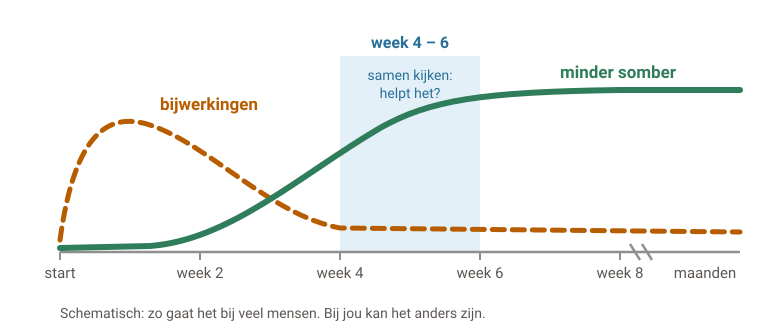
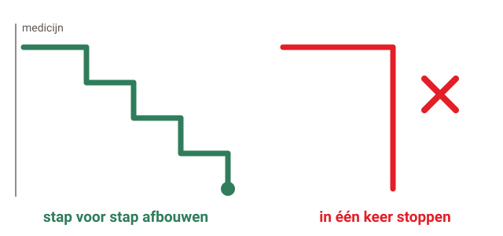

# Hoe werkt een SSRI?

Een SSRI is een medicijn tegen depressie of angst. Het werkt in de hersenen, op de plek waar zenuwcellen elkaar een seintje geven.

## 1. Wat doet een SSRI?

Legenda: serotonine (boodschapper), pompje, ontvanger.

### Stap 1: Seintje

#### Een seintje doorgeven

Zenuwcellen geven elkaar seintjes. Dat doen ze met kleine boodschappers. Eén daarvan heet **serotonine**.

Serotonine speelt een rol bij je stemming en bij angst.

### Stap 2: Terughalen

#### Het pompje haalt het terug

Na het seintje haalt een **pompje** de serotonine weer terug in de eerste zenuwcel.

Zo stopt het seintje.

### Stap 3: SSRI

#### De SSRI remt het pompje

Een SSRI remt het pompje. Daardoor blijft er **meer serotonine** tussen de zenuwcellen.

SSRI betekent: selectieve serotonine-heropname-remmer.

### Stap 4: Wennen

#### Je hersenen moeten wennen

Het pompje wordt meteen geremd. Maar je hersenen hebben **een paar weken** nodig om zich aan te passen.

Daarom merk je het effect pas na een tijdje. Hoe dit precies helpt, weten we nog niet helemaal.

## 2. Wanneer werkt het?

- **Eerst bijwerkingen.** Bijvoorbeeld misselijk, hoofdpijn of onrustig. Die worden meestal na een paar dagen tot weken minder.
- **Daarna het effect.** Je merkt het vaak pas na een paar weken. Ga door, ook als je nog niets merkt.
- In het begin spreek je je arts vaak, elke 1 tot 2 weken.
- **Na 4 tot 6 weken** kijk je samen met je arts of het helpt.

## 3. Hoe lang en hoe stop je?

- **Voel je je beter?** Blijf het medicijn dan nog minstens **een half jaar** slikken. Zo is de kans kleiner dat de depressie terugkomt.
- Had je vaker een depressie? Dan is **een jaar of langer** vaak beter.
- **Stop niet zomaar in één keer.** Overleg altijd eerst met je arts. Meestal bouw je af in stapjes. Anders kun je stop-klachten krijgen: grieperig, duizelig, slecht slapen.
- Stop-klachten zijn meestal binnen een week over. Slik je pillen niet om de dag.

## 4. Let op

#### Meer sombere gedachten?

In het begin kun je je soms somberder of angstiger voelen. Bij mensen onder de 25 komt dat iets vaker voor.

Denk je aan de dood of aan zelfmoord? **Bel meteen je huisarts of de huisartsenpost.** Of bel **113 Zelfmoordpreventie: 0800-0113** (gratis, dag en nacht).

#### Wat beter niet samengaat

- Geen alcohol of drugs.
- Geen sint-janskruid of andere kruidenmiddelen zonder overleg.
- Pijnstiller nodig? Paracetamol mag. Geen ibuprofen, naproxen of diclofenac zonder overleg: samen met een SSRI geven die meer kans op bloedingen.

#### Bijwerkingen die blijven

Minder zin in seks of moeilijker klaarkomen kan blijven zolang je het slikt. Ook kun je wat zwaarder worden. Praat erover: er is vaak iets aan te doen.

#### Autorijden

Heb je bijwerkingen, zoals slaperig of duizelig? Rijd dan niet zelf.

---

Deze uitleg is algemeen. Wat voor jou geldt, bespreek je met je huisarts.

Tekst en tekeningen: Huisartsenpraktijk Tolgaarde / Socev, [CC BY-SA 4.0](https://creativecommons.org/licenses/by-sa/4.0/deed.nl).
